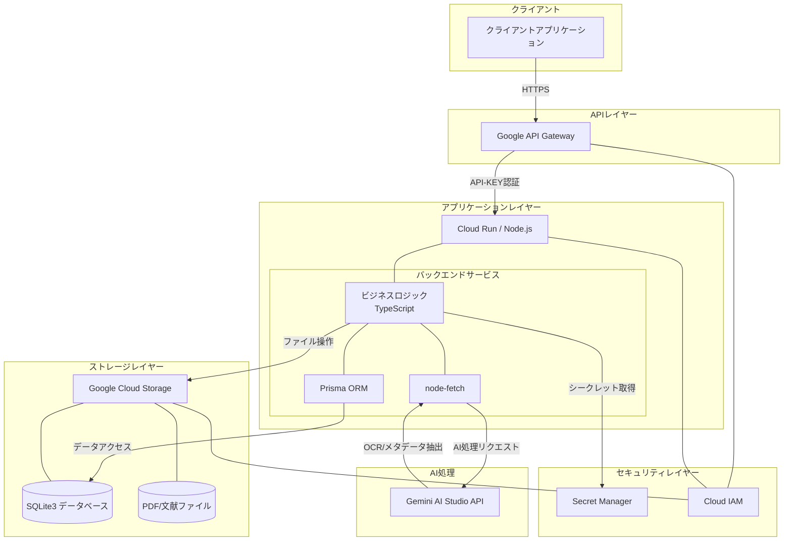

# システム構成設計書

## 1. 概要
### 1.1 システム構成の目的
本書は、書誌情報と本文ファイルをクラウド上で管理するシステムの技術的構成を定義します。サーバレスアーキテクチャを基本とし、低コストで高機能な文献管理システムの実現を目指します。

### 1.2 システム全体像
本システムは、Google Cloudのサーバレスアーキテクチャを基盤とし、文献ファイルとその書誌情報を管理するためのREST APIサービスを提供します。システムの全体構成は以下の通りです。



この構成により、単一ユーザー向けながらも高機能かつ低コストで運用可能なシステムを実現します。AIによる自動書誌情報抽出と安全なファイル管理を特徴とし、REST APIを介して柔軟に機能を提供します。

## 2. アーキテクチャ設計
### 2.1 全体アーキテクチャ
```
[図: 全体アーキテクチャ図]
```

### 2.2 コンポーネント構成
システムは以下の主要コンポーネントで構成されます：

1. **ストレージレイヤー**
   - Google Cloud Storage：PDFや文献ファイルの保存
   - SQLite3データベース：書誌情報のメタデータ管理（Cloud Storage上にマウント）

2. **APIレイヤー**
   - Google API Gateway：RESTful APIエンドポイントの提供
   - Cloud Run：Node.jsバックエンドサービスの実行環境

3. **アプリケーションレイヤー**
   - バックエンドサービス：Express.jsフレームワークを使用し、TypeScriptで実装されたビジネスロジック
   - バリデーション：Zodによる型安全なデータ検証
   - AIサービス連携：OCRと書誌情報抽出のための外部AI API連携

4. **フロントエンドレイヤー（オプション）**
   - REST APIを消費するクライアントアプリケーション

### 2.3 データフロー
TBD

## 3. 技術スタック
### 3.1 バックエンド
- サーバレスプラットフォーム: Google Cloud Run（コンテナベースのサーバレスサービス）
- プログラミング言語: Node.js, TypeScript
- Webフレームワーク: Express.js
- バリデーション: Zod
- ORM: Prisma
- HTTPクライアント: node-fetch
- テストフレームワーク: Vitest
- コンテナ化: Docker
- データベース: SQLite3（Google Cloud Storage上にマウント）
- ストレージ: Google Cloud Storage
- AI/ML処理: Gemini AI Studio API（Gemini 2.0 flashモデル）
  - OCR処理による文献テキスト抽出
  - 書誌情報の自動抽出と構造化

### 3.2 API層
- API管理: Google API Gateway
- 認証: API-KEY認証
- エンドポイント構成: RESTful API設計パターンに準拠

### 3.3 フロントエンド（必要に応じて）
TBD

### 3.4 CI/CD
- ビルド/デプロイ: Google Cloud Build
- ソース管理: Git
- インフラストラクチャ構成: Terraform（オプション）

## 4. インフラストラクチャ設計
### 4.1 クラウドリソース構成
- **Google Cloud Run**：バックエンドサービスのホスティング
- **Google Cloud Secret Manager**：APIキーやデータベース接続情報などの機密情報管理
- **Google Cloud Storage**：
  - バケット命名規則: `ezdocs-bucket-${PROJECT_ID}`
  - リージョン: アジア北東1（東京）`asia-northeast1`
  - ストレージクラス: 標準（STANDARD）
  - ディレクトリ構造:
    ```
    /
    ├── db/                 # SQLiteデータベースファイル
    │   ├── production.db   # 本番環境データベース
    │   └── backup/         # データベースバックアップ
    └── files/
        └── pdf/            # PDF文書ファイル
    ```
  - アクセス方法: Cloud Runボリュームマウント（gcsfuse）
  - マウントポイント: `/storage`
  - データ永続化: Cloud Storageに直接保存
  - IAMポリシー: Cloud Runサービスアカウントに読み書き権限を付与
- **Google API Gateway**：API管理とセキュリティコントロール
- **Google Cloud IAM**：リソースアクセス権限の管理
- **Google Cloud Build**：CI/CDパイプラインの実行環境

### 4.2 ネットワーク設計
- API GatewayへのHTTPS接続のみ許可
- 署名付きURLによる一時的なファイルアクセス
- VPC内部通信によるセキュアなサービス間連携

### 4.3 スケーリング戦略
- 単一ユーザー向けであるため、ベーシックな構成を基本とする
- サーバレスでの自動スケーリングを活用

## 5. セキュリティ設計
### 5.1 認証・認可
- API-KEYによるアクセス制御
- 署名付きURLによる本文ファイルアクセス
- Gemini AI Studio APIキーの安全な管理
  - シークレット管理サービスを利用したAPIキーの保護
  - 必要最小限の権限原則に基づくアクセス制御

### 5.2 データ保護
- 非公開バケット設定
- アクセスログの記録
- Gemini APIへ送信されるデータの最小化
  - 必要な情報のみを抽出してAPIに送信
  - 個人情報や機密情報のフィルタリング

### 5.3 その他のセキュリティ対策
- APIレート制限の実装
- 入出力データの検証とサニタイズ
- 定期的なセキュリティ監査とアップデート

## 6. 運用設計
### 6.1 バックアップと復元
#### データベースのバックアップ
- **バックアップ戦略**：
  現在検討中

#### 文書ファイルのバックアップ
- PDFファイルは自動的にCloud Storageに保存され、Google Cloudの冗長性メカニズムによって保護されます

#### 障害復旧シナリオ
1. **データベース破損**：
   - バックアップ戦略は検討中
   
2. **Cloud Storage障害**：
   - Googleの冗長化システムにより自動的に対応されるケースが多い
   - リージョン障害の場合は、新しいリージョンへの移行を検討

3. **サービス全体の復旧**：
   - バックアップ戦略は検討中
   - Cloud Runサービスを再デプロイ

### 6.2 監視とアラート
- Google Cloud Monitoringによるリソース使用状況の監視
- エラーログとアプリケーションパフォーマンスの追跡
- しきい値ベースのアラート設定

### 6.3 障害対応
- 障害発生時の自動フェイルオーバー戦略
- サービス復旧手順の文書化
- 障害報告と分析プロセスの確立

### 6.4 デプロイ戦略
- Google Cloud Buildを使用した自動ビルドとデプロイ
- Cloud Buildトリガーによるコード変更時の自動デプロイ
- ビルドプロセス：
  1. ソースコードのクローン
  2. 依存関係のインストール
  3. テストの実行
  4. Dockerイメージのビルド
  5. Containerレジストリへのプッシュ
  6. Cloud Runサービスの更新
- ロールバック手順の整備

## 7. 変更履歴
- 2025/03/02 - バージョン0.1 - 初版作成 - lost_and_found

## APIの制限事項

### リクエスト制限

- **JSONリクエストサイズ**: 最大30MB（PDFファイルのbase64エンコードデータ対応のため）
- **レート制限**: Google Cloud API Gatewayにより実装

### レスポンス制限

- **レスポンスタイムアウト**: 60秒
